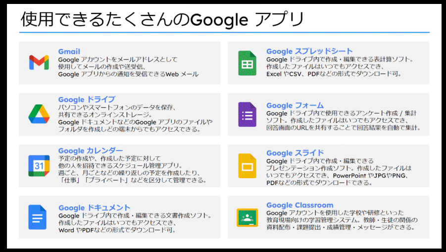
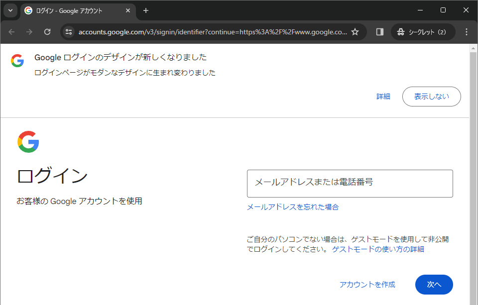
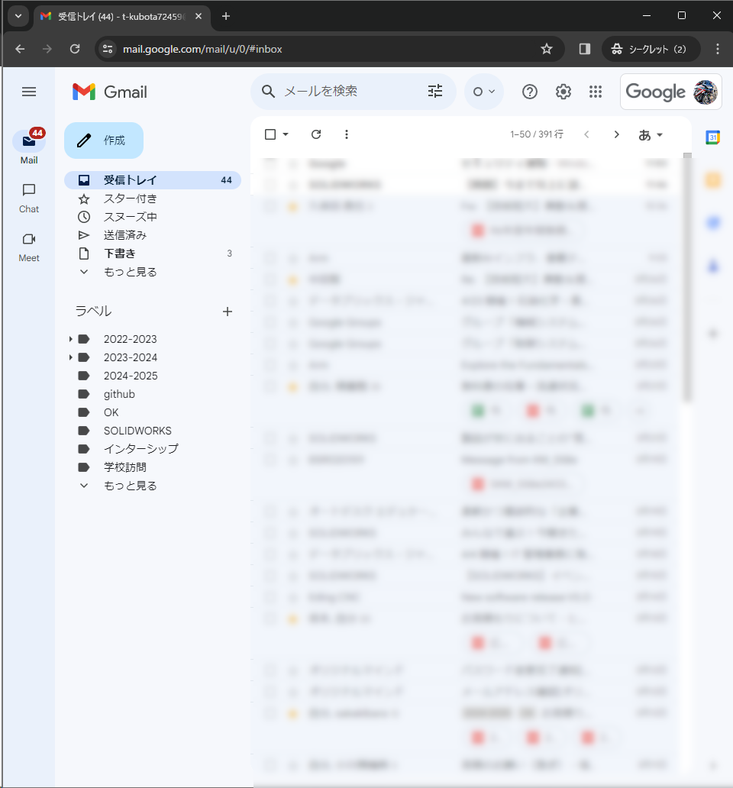
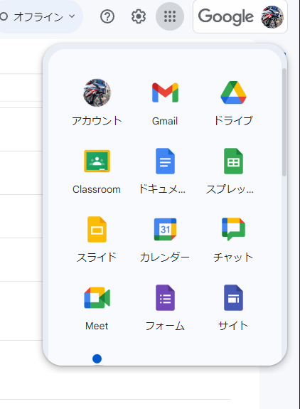
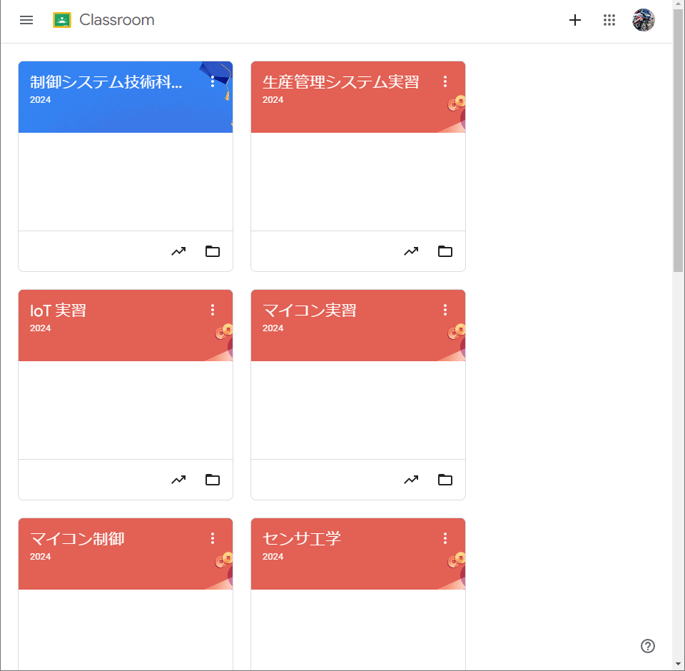
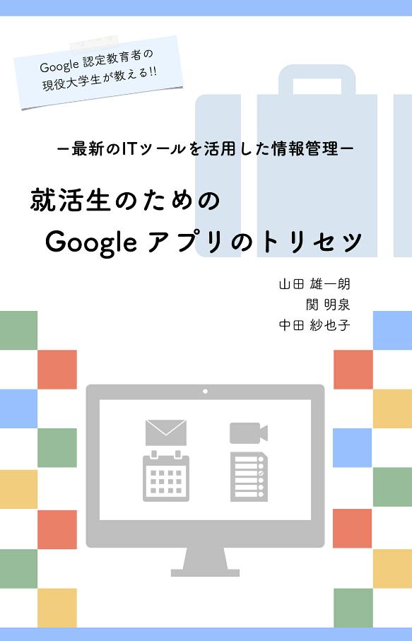

# 情報処理実習Ⅰ

# Google Education ってなに

Google Education とは Google が展開する学校支援用のウェブ (クラウド) サービスのことです。
Google が開発したアプリを基盤にして、次にようなサービスを提供しています。

- Gmail, カレンダー、Chat, Meet, Google ドライブ、Google オフィス (マイクロソフト Office みたいなやつ)
- Google アカウント (メールアドレス) が用意される

  

## もう卒業のときのはなし

**有効期限は卒業年度の 3/31 or 退校まで。卒業したあとも必要なデータは自分でバックアップしておくように。**

## Google Classroom

Google Education のメイン機能で、各授業ごと先生からの連絡事項などが案内される。  
久保田先生は Google Education を通じて授業の資料など案内しますので、Google Classroom に慣れておくように。

# ログイン方法

<http://google.com/> にアクセスして、ログインする。

  

Google アカウント (メールアドレス) は次のような形式です：

> {6a|6b}<.XXXXX@vt-school.hiroshima.jp>

@から後ろ "vt-school.hiroshima.jp" を「ドメイン」といいます。
広島県内の職業能力開発施設で共通です。

<dl>
<dt>{6a|6b}.</dt><dd>6a 短大の機械システム技術科   
6b 短大の制御システム技術科</dd>
<dt>XXXXX</dt><dd>5 桁の学籍番号</dd>
</dl>

初期パスワードは XXXXXXXXX 。
変更するように求められる。新しいパスワードには記号や数字を含める必要がある。

## **変更したパスワードは忘れないように！！**

ウェブブラウザ (Google Chrome) のパスワードマネージャーに「パスワードを保存しますか？」と聞かれたら保存しておこう。

# Gmail

電子メールを送受信するためのツール。

  

## 先生からのおすすめ

就活サイトなどでメールアドレスの登録が必要なときや面接などでメールアドレスを聞かれた際には、この Education のアドレスを使用することをすすめる。
自分の持っているプライベートな携帯電話のアドレスを登録すると、機種変などにより企業との連絡がつかなくなる恐れがある（実際にそういうことがあった）。このアドレスであれば、少なくとも在籍期間中は利用することができる。

「え、あんまり学校のサイトにアクセスしたくないし…」というあなたには、のちほどメールの転送方法を教えよう。
## 自分にメールしてみよう

まず自分にメールを送ってみよう。意味のないことだと思うかもしれない。
そんなことはなく、簡単なメモの代わりになる。

## メールを作成してみよう

つぎに <XXXXXXXXXX@vt-school.hiroshima.jp> にメールを送ってみよう。

- メアドをまちがえないように！
- インターネットのルールではメールアドレスは大文字・小文字は区別しませんが、相手から教えてもらったままの文字を使ったほうがいいでしょう。

## 返信をしてみよう

<XXXXXXXXXXX@vt-school.hiroshima.jp> さんから返事が来たと思います。
受信トレイのアドレス（名前の表示）などが更新されたと思います。やり取りがあると相手が設定した日本語名が表示されるようになります。

## 練習

お互いに自己紹介メールを送りあってみよう。
メールのマナーとして一つ覚えておいてほしいことは、最初に名乗ること。  
最初に名乗っておくと、読んだ人が「あ、この人からのメールなんだ」と送り手を認識して読むことができます。

例えば会社などの面接にお礼をする場合：

> ○○株式会社 人事部 △△さま  
> お世話になっております。□□県立技術短期大学校の※※です。  
> 本日は面談のお時間をいただき、ありがとうございました。  
> 大変参考なり、今後の就職活動についての検討材料となりました。  
> 
> 今後も引き続きよろしくお願いいたします。  

## Gmail の設定 これだけはやっておけ

Gmail にはメールを効率的に送受信・整理するための様々な設定がある。  
これだけは設定しておいたほうがいい、というおススメの設定を紹介する。

- 設定画面の呼び出し  
右上の歯車をクリック ⇒ すべての設定を表示

### 全般：スレッド表示

メールを話題ごとにまとめたものを「スレッド」という。スレッド表示すると、ひとつの話題ごとにまとまった形式で見ることができる。

### 全般：返信は「全員に返信」

返事をするときに受信したメールの宛先にあるアドレス全員を含めて返信する設定。
「返信」は送信者にしか返事をしない設定になる。

### 全般：送信取り消し

何度も確認しても、送信ボタンを押した後にミスに気づいたり、添付ファイルをわすれたりる。そのために「送信取り消し機能」がある。

5 秒から 30 秒までの 4 段階設定。先生のおすすめは最長の 30 秒。

この 30 秒で救われる場面が必ずある。

### 全般：画像プロフィール (余力があれば？)

画像を設定しておけば就職先の人事のひとにも顔を覚えてもらえる。
ただし個人情報にかかわるので慎重に。
アーティストやアニメ・マンガの画像などを利用するときは著作権に留意して（基本NG）。

### 全般：署名

メールの「署名」とは、メールの末尾につける名前や連絡先の部分のことをいう。
メールのマナーとして署名設定をしておいたほうが良い。

### 全般：AI によるスマート作成やスペルチェック

- 文法
- スペルチェック
- 自動修正
- スマート作成

有効にしておこう。

### メール転送

先生がすすめても「Gmail なんて使いたくない！！わたしは iPhone ユーザーで普段のアドレスは Apple のメールだし！」という人もいるでしょう。そういう人は vt-school.hiroshima.jp 当てに来たメールを別アドレスに転送する機能を紹介する。

#### 設定手順

1. Gmail の設定画面で、「メール転送と POP/IMAP」タブを選択する
1. 設定画面で転送：の欄に転送先アドレスを設定する
1. 設定した転送先アドレスに確認メールが届く
1. 英語だが、その中のリンクをクリックし、転送を了承する（上のリンク）  
下のリンクは転送を拒否する
1. Gmail の設定画面に戻り、転送を許すアドレスを選択する  
元のメールは残しておいてもいいし、削除してもよい

### 転送メールの設定にしたけど、ちょっとまて、返事に注意

転送機能を使って転送されてきたメールに返事をしようとしたとする。

そのときの送り元アドレス (From) は iPhone のアドレスになってしまう。vt-school.hiroshima.jp ではなくなる。そうすると、受け取った側が「あれ、vt-school.hiroshima.jp 宛てに送ったはずなのに、なんで、iPhone のアドレス？」と混乱するので、転送メールは読むだけとどめ、返事が必要なメールについてのお返事は Gmail からするのがよいでしょう... (もちろん相手が事情が理解していれば返事を送ってもよい)

または、すいません、Gmail アプリを入れてください… m(__)m

# お互いにメールを送ってみよう

- 署名設定をしてお互いのメールアドレスにメールを送ってみよう

## 件名について

メールには件名 (Subjet:) という欄がある。これについて少し考えてよう。

- 「○○について」「○○の件」問題  
  "ついて" だったり "の件" というのは、わかっているので、ほとんどの場合ないほうがすっきりする。送るときに一工夫できないか考えてみよう。

### 例）どっちがわかりやすい？

どちらが相手にわかりやすい件名か、送る前にちょっと一呼吸おいて考えてみよう。

a) インターンシップについて  
b) インターンシップの日程変更の連絡

# 送信先アドレスの使い分け To: と Cc: と Bcc: と

メールの送信先には 3 種類ある。
To: と Cc: と Bcc:
動作は同じで、メールが送られるのだが送信者が込めた思いが違う。

<dl>
<dt>To:</dt>
<dd>返事が欲しい、どうしても読んでおいてほしい。</dd>
<dt>Cc:</dt>
<dd>参考としての送信（読んでおいてほしいが返事までは求めない）</dd>
<dt>Bcc:</dt>
<dd>To: や Cc: の人には送信されていることがわかりません。送信先メールアドレスが残らない。送信先のお互いにメールアドレスを知らせたく場合などに使用する。
</dl>

**就活などで To: 宛てでメールを受け取った時にはなるべく早く返信しましょう。**
**忙しくて返信できないときも「メールを受け取りました。お返事は後日改めて送ります。」でも相手は安心します。**

# 添付ファイル

メールに添付ファイル (写真など) がつけれるのはご存じでしょう。
添付ファイルにもいくつか注意事項があるので紹介します。

## サイズは大丈夫？

大きなサイズのファイルは送れません (受信先の設定にもよる)。
別な手段を考えましょう。

## 特別なアプリがいる？

添付ファイルの内容を確認するのに特別なソフトウェアが必要な場合、相手に確認を取りましょう。

## ウィルスは大丈夫？

ウィルスに感染したと思われるファイルを送ってはいけません。逆に怪しい添付ファイルが送られてきても、不用意に開かないようにしましょう。

## PPAP 問題... セキュリティ

メールの添付ファイルにはこんな問題もあります。知っておくといいでしょう。

<https://business.ntt-east.co.jp/content/coworkstorage/column-12.html>

## no-reply@ アドレスに返事はできない

ときどき、Google などいろいろなシステムで自動的に送られてくる自動メールがあります。そのようなメールで no-reply@ で始まるアドレスで送られてくるものがあります。

no-reply 直訳すると「返事はできません」という意味です。no-reply@ アドレスに返事を書いても誰にも読まれません。注意してください。

# Google ドライブ

Google ドライブはインターネットのクラウド上にファイルを置くためのサービスです。

学校内でも共有サーバー (学生共有) というファイルサーバーがありますが、学外からはアクセスできません。

Google ドライブはインターネット上にサーバーがあるので、インターネットに接続できれば世界中からアクセスできます。つまり家からでもアクセスできる！！！これが学生共有とは大きな違いです。

裏を返すとパスワードがゆるゆるだと、即、情報漏洩につながります。
パスワードはなるべく難しいものにして、きちんと管理しましょう。

# Google Classroom

ブラウザ右上のメニューから Classroom を探します。

  

Classroom の画面が開きます。自分が出席している科目のアイコンが並んでいます。

  

トップ画面（ストリーム画面といいます）は先生からの連絡などが表示されます。
授業画面は授業ごとの配布資料や課題が確認できます。
メンバー画面は参加している先生・学生（生徒）が確認できます。

Google Meet のリンクは画面共有や配信のためのリンクです。
先生に指示されたらオンラインミーティングに参加できるようにしておきましょう。

# 参考

こんな Kindle 本もあるようです。就活の便利ツールとして使ってください (アマプラ会員なら 0 円です)。：

-  https://www.amazon.co.jp/dp/B093QBRLSX/

  

# 最後に（特に制御システム技術科の学生へ）

久保田先生の授業はこの Google Education をベースにして連絡など行います。

- 学校にきたら一日一度は vt-school.hiroshima.jp あてメールをチェックする
- 自分のスマホで受け取れるように転送設定する
- Android なひとは、vt-school.hiroshima.jp アカウントもスマホに追加する
- iPhone なひとは、Gmail アプリをインストールする

少なくともどれか一つは実施して「連絡を知りませんでした」みたいなことにならないようにしてくださいね。
